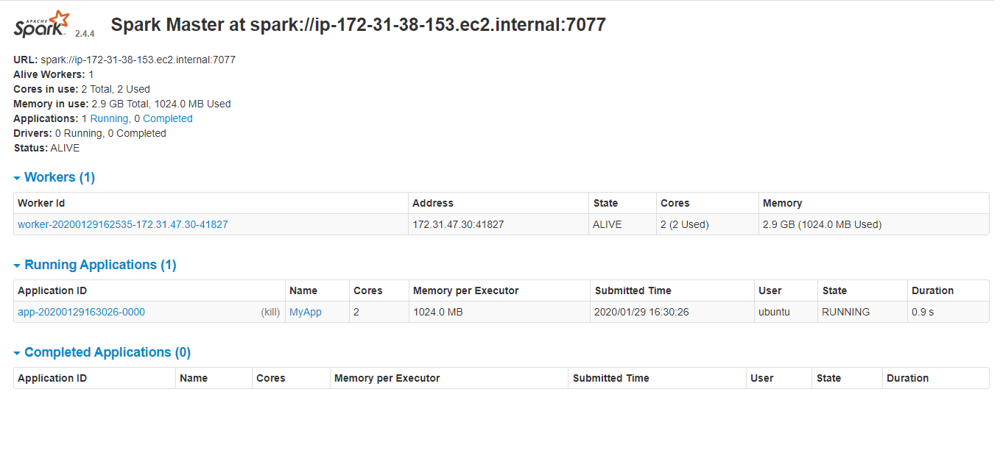

# Project for CloudComputing
Poker hand analysis

Main topic of a project was to set a Spark cluster of one Master and one Slave and compute simple python code from OIC_01.ipynb via mentioned.
Spark cluster was set on two AWS instances, t2.small with 1 core and 2GB memory as a Master and t2.medium with 2 cores and 4GB memory as a Slave.
I wanted to check a time of processing the code on t2.small instance alone and on Spark cluster, yet little I knew that Apache suggests leaving
one core free to make sure slave instance would work properly. I ran the code both on t2.small itself and on Spark cluster just to find out
that Spark cluster computing time is circa ~7 second longer than t2.small. What was suprising, code was writen to run on one core of Slave instance
in Spark Cluster, yet as you can see in the image below, 2 cores of a Slave are in use.

File 'poker_dataset.csv' contains all poker hands possible, ranked as described in 'pokerReadMe.txt'. I attach sample of a dataset
due to limit of 25MB of the file in a repository. Analyse of given dataset shows that after drawing 2 cards from a deck of 52, we gain
access to no more than 0.75% of all poker hands possible of which more than 50% are nothing more than a High Card. Further analyse of
a dataset requires code developement but main task of using AWS Cloud to compute is considered done.
